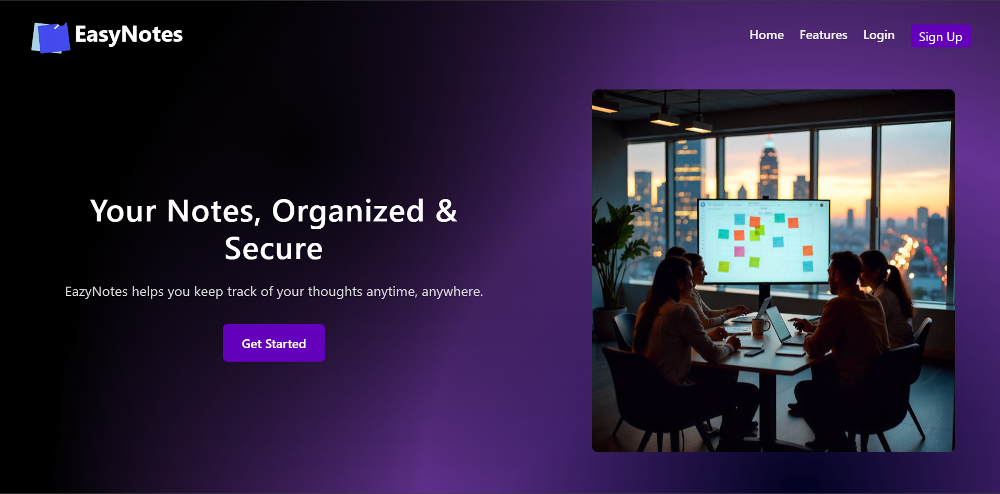
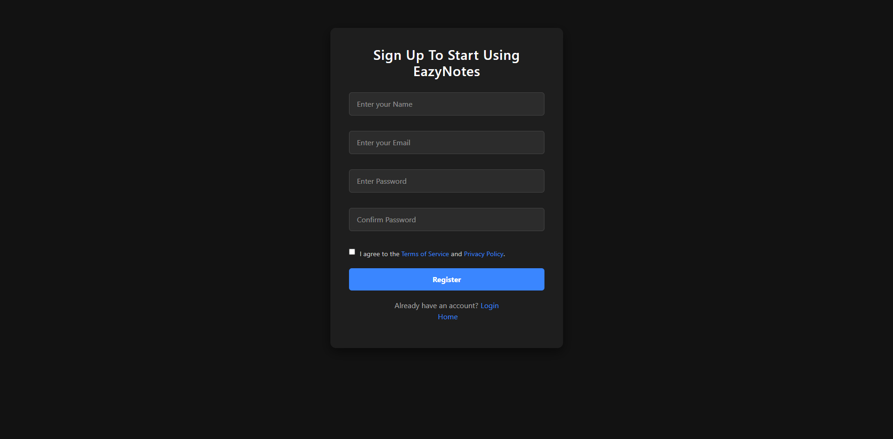
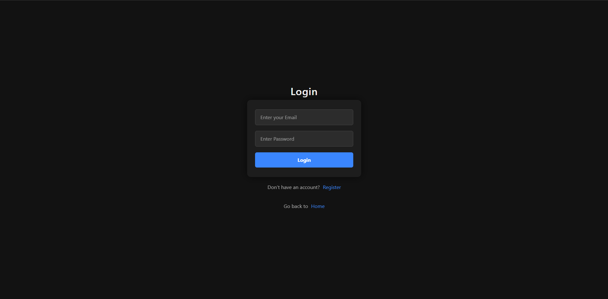
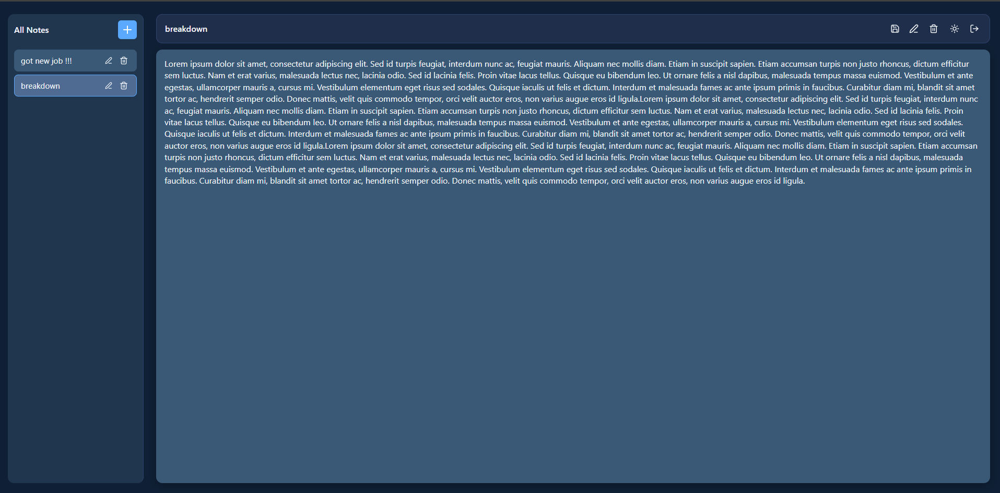

# EasyNotes

A full-stack notes management web application that allows users to register, log in, and manage personal notes in a clean, responsive interface. This was a collaborative project built with [@joiel04](https://github.com/joiel04).

---

## Overview

EasyNotes is a MERN-adjacent web application built with React on the frontend and Node.js/Express with MongoDB on the backend. It supports secure user authentication via JSON Web Tokens and provides a minimal, distraction-free environment for writing and organizing personal notes.

---

## Project Snippets

 
 


---

## Features

- **Landing Page** — A polished home page introducing the application with navigation to Login and Sign Up.
- **User Registration** — New users can create an account with name, email, and password.
- **User Authentication** — Sessions are managed using access and refresh tokens stored via HTTP-only cookies.
- **Notes Dashboard** — A sidebar listing all notes alongside a main panel to view content.
- **Create, Edit, and Delete Notes** — Full note management from the dashboard.
- **Persistent Storage** — Notes are stored in MongoDB and fetched on each session.

---

## Tech Stack

**Frontend** — React, Vite, React Router, Tailwind CSS

**Backend** — Node.js, Express, MongoDB, JWT

---

## Project Structure

```
easynotes/
├── frontend/          # React + Vite application
│   ├── src/
│   └── .env
├── backend/           # Express + MongoDB API server
│   ├── src/
│   │   └── server.js
│   └── .env
```

---

## Setup and Installation

### Prerequisites

- Node.js (v18 or higher recommended)
- npm
- A running MongoDB instance (local or MongoDB Atlas)

---

### 1. Clone the Repository

```bash
git clone https://github.com/your-username/easynotes.git
cd easynotes
```

---

### 2. Backend Setup

```bash
cd backend
npm install
```

Create a `.env` file in the `backend` directory. Refer to `.env.sample` below:

**`backend/.env.sample`**
```dotenv
MONGODB_URI=mongodb://localhost:27017/easynotes

ACCESS_TOKEN_SECRET=your_access_token_secret_here
REFRESH_TOKEN_SECRET=your_refresh_token_secret_here

ACCESS_TOKEN_EXPIRY=15m
REFRESH_TOKEN_EXPIRY=7d

PORT=5000
FRONTEND_URL=http://localhost:5173
```

> For production, replace `MONGODB_URI` with your Atlas connection string and `FRONTEND_URL` with your deployed frontend URL.

```bash
npm start
```

---

### 3. Frontend Setup

```bash
cd frontend
npm install
```

Create a `.env` file in the `frontend` directory:

**`frontend/.env.sample`**
```dotenv
VITE_API_BASE_URL=http://localhost:5000
```

> For production, replace this with your deployed backend URL.

```bash
npm run dev
```

The app will be available at `http://localhost:5173`.

---

## Environment Variables Reference

### Backend

| Variable | Description |
|---|---|
| `MONGODB_URI` | MongoDB connection string |
| `ACCESS_TOKEN_SECRET` | Secret used to sign access tokens |
| `REFRESH_TOKEN_SECRET` | Secret used to sign refresh tokens |
| `ACCESS_TOKEN_EXPIRY` | Access token expiry duration (e.g. `15m`) |
| `REFRESH_TOKEN_EXPIRY` | Refresh token expiry duration (e.g. `7d`) |
| `PORT` | Port on which the Express server runs |
| `FRONTEND_URL` | Frontend URL used for CORS configuration |

### Frontend

| Variable | Description |
|---|---|
| `VITE_API_BASE_URL` | Base URL of the backend API |

---

## Authors

- [Alvin Thomas](https://github.com/Alvin2211)
- [Joiel Soji](https://github.com/joiel04)

---

## License

ISC
